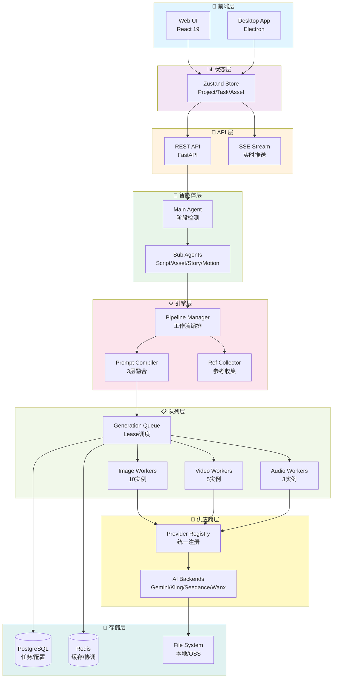
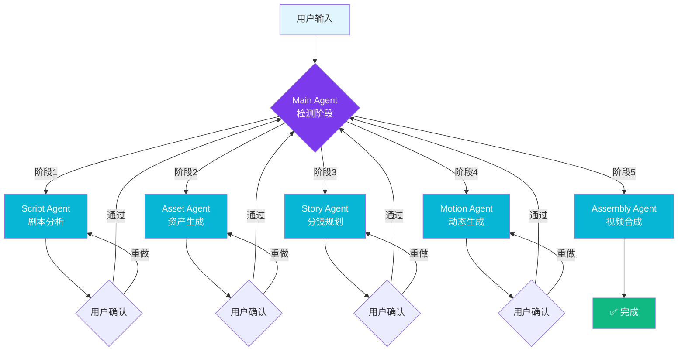
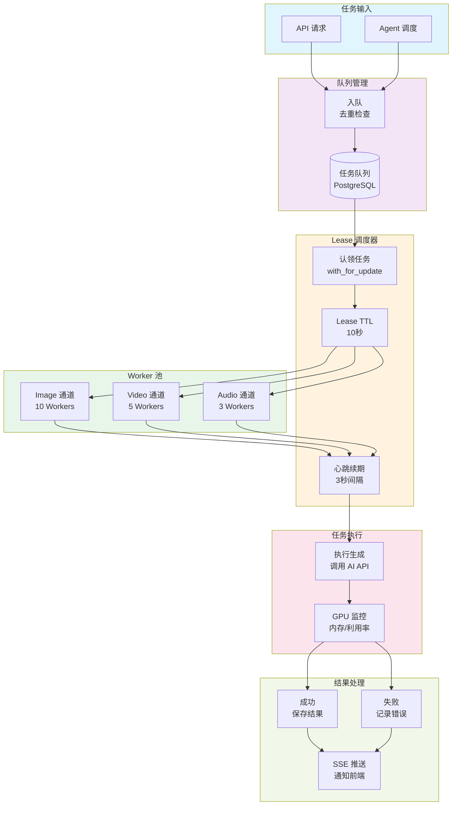
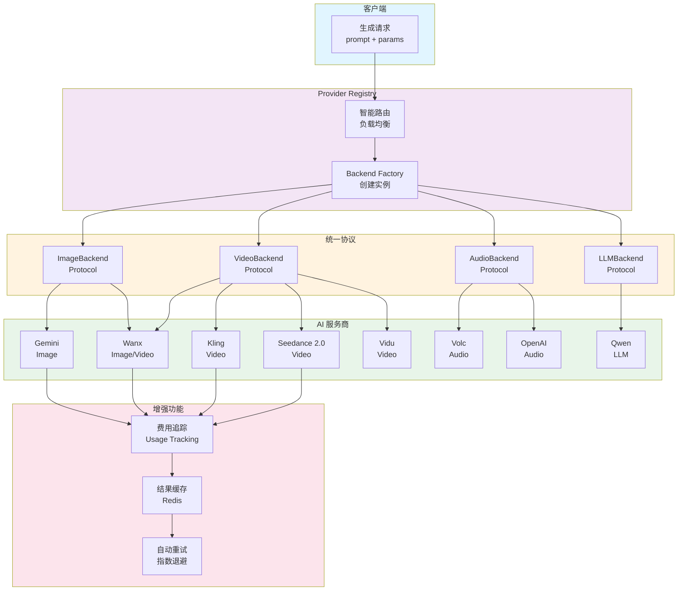
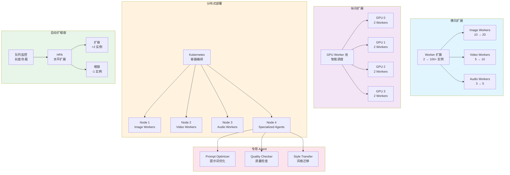
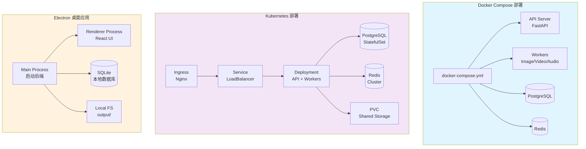

# 统一视频创作平台 - 架构图集

## 主架构图

### 整体系统架构



## 子架构图

### 1. 数据流架构

```mermaid
graph LR
    A[📝 剧本输入] -->|LLM分析<br/>3s| B[实体提取<br/>角色/场景/道具]
    B -->|资产生成<br/>30s| C[资产图库<br/>多变体]
    C -->|参考收集<br/>1s| D[智能组装<br/>collectAllRefs]
    D -->|提示词编译<br/>2s| E[3层融合<br/>时间轴+约束]
    E -->|参数校验<br/>1s| F[Seedance验证<br/>≤9图+≤3视频]
    F -->|任务入队<br/>1s| G[异步队列<br/>Lease调度]
    G -->|并行生成<br/>120s| H[分镜视频<br/>4-15s片段]
    H -->|FFmpeg合成<br/>30s| I[🎬 最终视频]
    
    style A fill:#e1f5ff
    style B fill:#dbeafe
    style C fill:#fef3c7
    style D fill:#d1fae5
    style E fill:#fed7aa
    style F fill:#fecaca
    style G fill:#e0e7ff
    style H fill:#f3e5f5
    style I fill:#86efac
```



### 2. 智能体协作架构



### 3. 任务队列架构



### 4. 多供应商架构



### 5. 提示词编译架构

```mermaid
graph TB
    subgraph Input["输入"]
        Scene[Scene<br/>场景信息]
        Chars[Characters<br/>角色列表]
        Props[Props<br/>道具列表]
    end
    
    subgraph Layer1["第1层: 参考收集"]
        Collect[collectAllRefs<br/>智能收集]
        CharImg[角色参考图<br/>最佳变体]
        SceneImg[场景参考图<br/>最佳变体]
        PropImg[道具参考图<br/>最佳变体]
        PrevVideo[前一分镜<br/>首帧图]
    end
    
    subgraph Layer2["第2层: 时间轴构建"]
        Timeline[时间轴分段<br/>根据时长]
        Short["短片段 ≤5s<br/>单一动作"]
        Medium["中片段 5-10s<br/>起承转"]
        Long["长片段 >10s<br/>起承转合"]
    end
    
    subgraph Layer3["第3层: 描述融合"]
        Fusion[融合描述<br/>+ @image标记]
        CharDesc[角色描述<br/>@image1 @image2]
        SceneDesc[场景描述<br/>@image3]
        Camera[镜头运动<br/>推进/摇镜头]
    end
    
    subgraph Validation["Seedance 约束验证"]
        Check[参数校验]
        ImgCheck["图像 ≤9张<br/>≤30MB"]
        VidCheck["视频 ≤3个<br/>≤50MB"]
        AudCheck["音频 ≤3个<br/>≤15MB"]
        LenCheck["提示词 ≤5000字符"]
    end
    
    subgraph Output["输出"]
        Result[CompiledPrompt<br/>prompt + refs]
    end
    
    Scene --> Collect
    Chars --> Collect
    Props --> Collect
    Collect --> CharImg
    Collect --> SceneImg
    Collect --> PropImg
    Collect --> PrevVideo
    
    CharImg --> Timeline
    SceneImg --> Timeline
    PropImg --> Timeline
    PrevVideo --> Timeline
    
    Timeline --> Short
    Timeline --> Medium
    Timeline --> Long
    
    Short --> Fusion
    Medium --> Fusion
    Long --> Fusion
    
    Fusion --> CharDesc
    Fusion --> SceneDesc
    Fusion --> Camera
    
    CharDesc --> Check
    SceneDesc --> Check
    Camera --> Check
    
    Check --> ImgCheck
    Check --> VidCheck
    Check --> AudCheck
    Check --> LenCheck
    
    ImgCheck --> Result
    VidCheck --> Result
    AudCheck --> Result
    LenCheck --> Result
    
    style Input fill:#e1f5ff
    style Layer1 fill:#dbeafe
    style Layer2 fill:#fef3c7
    style Layer3 fill:#d1fae5
    style Validation fill:#fed7aa
    style Output fill:#86efac
```

### 6. 扩展架构



### 7. 部署架构



## 架构图使用说明

### 主架构图
- **整体系统架构**: 展示 8 层架构的完整视图
- 适用场景: 项目介绍、技术分享、架构评审

### 子架构图
1. **数据流架构**: 展示从剧本到成片的完整流程
2. **智能体协作架构**: 展示 5 阶段 Agent 协作流程
3. **任务队列架构**: 展示 Lease 调度和 Worker 执行
4. **多供应商架构**: 展示 Provider Registry 和统一协议
5. **提示词编译架构**: 展示 3 层融合和 Seedance 约束
6. **扩展架构**: 展示横向/纵向/分布式扩展方案
7. **部署架构**: 展示 3 种部署方式

### 在线渲染
- GitHub: 自动渲染 Mermaid 图表
- VS Code: 安装 Mermaid Preview 插件
- 在线工具: https://mermaid.live/

### 导出图片
```bash
# 使用 mermaid-cli
npm install -g @mermaid-js/mermaid-cli
mmdc -i ARCHITECTURE_DIAGRAMS.md -o architecture.png
```
