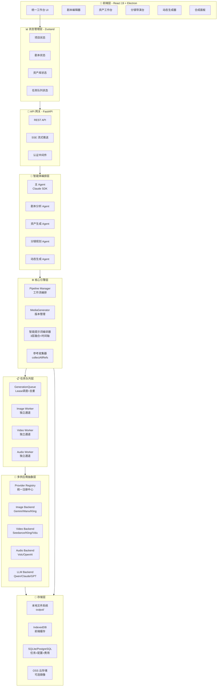
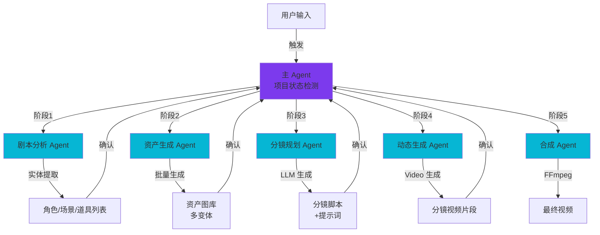
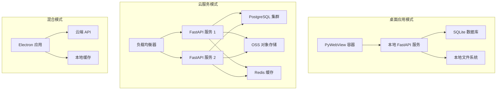

# 统一视频创作平台架构设计

## 综合架构图

## 核心数据流

```mermaid
graph LR
    A["📝 剧本输入"] -->|LLM 解析| B["场景列表<br/>+角色/场景/道具"]
    B -->|用户编辑| C["资产定义<br/>多变体管理"]
    C -->|Image 生成| D["资产图库<br/>≤9图/资产"]
    D -->|智能收集| E["参考组装<br/>collectAllRefs"]
    E -->|提示词编译| F["3层融合提示词<br/>动作+镜头+对白"]
    F -->|参数校验| G["Seedance 约束<br/>≤9图+≤3视频+≤3音频"]
    G -->|入队| H["任务队列<br/>Lease调度"]
    H -->|并行执行| I["分镜视频<br/>4-15s片段"]
    I -->|FFmpeg 合成| J["最终视频<br/>含音效/BGM"]
    
    style A fill:#e1f5ff
    style B fill:#f3e5f5
    style C fill:#fce4ec
    style D fill:#fff3e0
    style E fill:#e8f5e9
    style F fill:#f1f8e9
    style G fill:#fff9c4
    style H fill:#e0f2f1
    style I fill:#f3e5f5
    style J fill:#c8e6c9
```

## 智能体协作流程

## 关键创新点

### 1. 五层级联数据流 + 智能参考收集
- **来源**: moyin-creator
- **增强**: 结合 LumenX 的实体提取和 ArcReel 的版本管理
- **实现**: 
  - 剧本 → 角色 → 场景 → 分镜 → 成片，每层自动流入下一层
  - `collectAllRefs` 自动识别并组装角色/场景/首帧图到 API 请求
  - 每个资产支持多变体管理，用户可选择最佳版本

### 2. 多供应商统一抽象 + 智能路由
- **来源**: ArcReel + LumenX
- **增强**: 结合 moyin-creator 的 API Key 轮询负载均衡
- **实现**:
  - `ProviderRegistry` 统一管理所有 AI 服务商
  - Image/Video/Audio/LLM 四大后端协议
  - 支持全局/项目级切换，自动模型发现
  - RPM 速率限制 + 自动重试 + 费用追踪

### 3. Seedance 2.0 多模态约束系统
- **来源**: awesome-seedance-2-guide + moyin-creator
- **增强**: 结合 LumenX 的提示词润色和 ArcReel 的任务队列
- **实现**:
  - 智能三层提示词融合（动作+镜头语言+对白唇形同步）
  - 时间轴分段 + 关键词触发 + 多模态策略
  - 自动参数校验（≤9图+≤3视频+≤3音频+≤5000字符）
  - 首帧图网格拼接策略，确保角色一致性

### 4. 异步任务队列 + Lease 调度
- **来源**: ArcReel
- **增强**: 结合 moyin-creator 的轮询调度和 LumenX 的 FFmpeg 合成
- **实现**:
  - SQLAlchemy ORM 后端，支持 SQLite/PostgreSQL
  - Lease-based 并发控制（TTL=10s，心跳3s）
  - Image/Video/Audio 独立通道，避免相互阻塞
  - 去重机制 + 断点续传 + SSE 实时推送

### 5. Claude Agent SDK 多智能体编排
- **来源**: ArcReel
- **增强**: 结合 LumenX 的 Pipeline Manager 和 moyin-creator 的五大面板
- **实现**:
  - 主 Agent 检测项目状态，自动 dispatch 聚焦 Subagent
  - 每个 Subagent 完成单一任务后返回摘要，保护上下文
  - 阶段间确认机制，支持从任意阶段进入和中断恢复
  - Skill 编排系统，可扩展自定义工作流

### 6. 本地优先 + 云镜像混合存储
- **来源**: LumenX
- **增强**: 结合 moyin-creator 的 IndexedDB 和 ArcReel 的版本追踪
- **实现**:
  - 所有生成的媒体优先写入本地 `output/` 目录
  - IndexedDB 作为前端缓存，支持离线工作
  - OSS 作为可选的备份和签名 URL 服务
  - 版本管理系统，支持回滚和对比

## 技术栈

### 前端
- React 19 + TypeScript
- Electron（桌面应用）
- Zustand（状态管理）
- Tailwind CSS 4
- Radix UI（组件库）

### 后端
- FastAPI + Python 3.12+
- Pydantic 2（数据验证）
- SQLAlchemy 2.0 Async（ORM）
- Alembic（数据库迁移）

### AI 智能体
- Claude Agent SDK（Skill + Subagent 架构）
- @opencut/ai-core（多供应商调度）

### 媒体生成
- Seedance 2.0（多模态视频）
- Kling/Vidu/Pixverse（视频生成）
- Wanx/Gemini（图像生成）
- Volc/OpenAI（音频生成）
- Qwen/Claude/GPT（LLM）

### 存储
- SQLite（开发）/ PostgreSQL（生产）
- IndexedDB（前端缓存）
- 本地文件系统 + OSS（可选）

### 部署
- Docker Compose
- PyWebView（桌面应用打包）

## 核心模块

| 模块 | 职责 | 关键类/函数 |
|------|------|-----------|
| **frontend/panels/** | 五大核心面板 | Script/Asset/Story/Motion/Assembly |
| **frontend/stores/** | Zustand 状态管理 | project/script/asset/task stores |
| **server/routers/** | REST API 路由 | projects/generate/assistant/tasks |
| **server/agent_runtime/** | Claude Agent SDK 集成 | AssistantService/SessionManager |
| **lib/pipeline.py** | 工作流编排 | PipelineManager |
| **lib/media_generator.py** | 媒体生成中间层 | MediaGenerator（版本管理） |
| **lib/prompt_compiler.py** | 智能提示词编译 | 3层融合+时间轴+关键词 |
| **lib/ref_collector.py** | 参考收集器 | collectAllRefs |
| **lib/generation_queue.py** | 异步任务队列 | GenerationQueue/Lease调度 |
| **lib/generation_worker.py** | 后台 Worker | ProviderPool（image/video/audio通道） |
| **lib/provider_registry.py** | 多供应商注册中心 | ProviderRegistry/Factory |
| **lib/backends/** | 多供应商后端实现 | image/video/audio/llm backends |
| **lib/project_manager.py** | 项目文件系统管理 | ProjectManager |
| **lib/db/** | SQLAlchemy ORM 层 | models/repositories |

## 部署架构

## 优势总结

1. **完整的创作工作流**: 从剧本到成片的全流程覆盖，每个环节都有 AI 辅助
2. **多供应商容错**: 支持多个 AI 服务商，降低单点依赖风险
3. **智能提示词系统**: 3层融合+时间轴+关键词，将创意需求转化为可控结果
4. **异步任务队列**: Lease 调度+独立通道，支持大规模并发生成
5. **多智能体协作**: Claude Agent SDK 编排，支持复杂工作流和中断恢复
6. **本地优先存储**: 支持离线工作，云端可选，数据安全可控
7. **版本管理系统**: 支持多变体管理、回滚和对比
8. **灵活部署**: 支持桌面应用、云服务、混合模式三种部署方式
